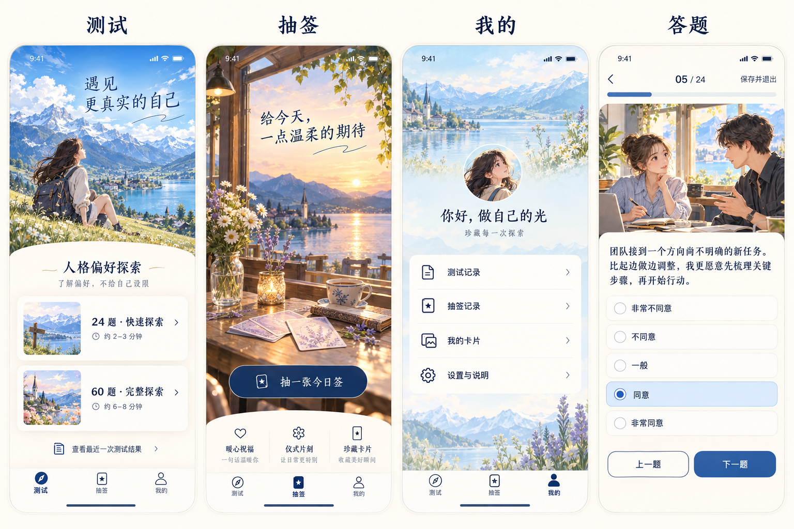
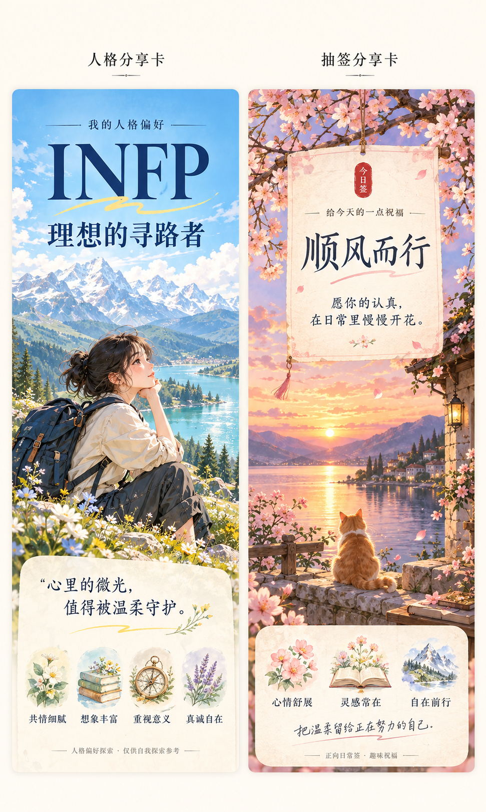
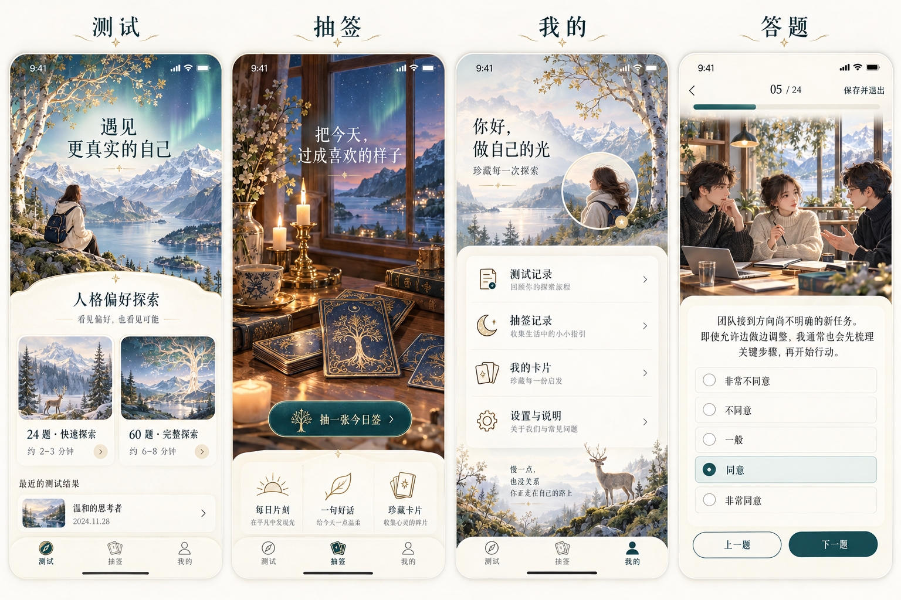
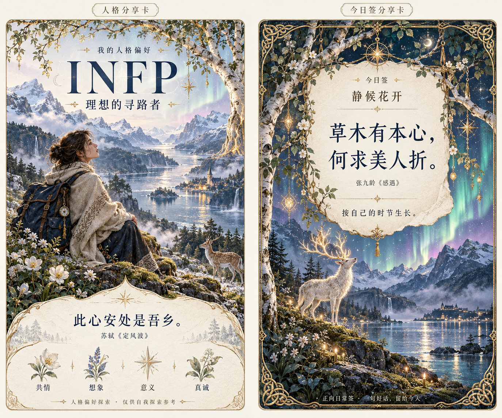
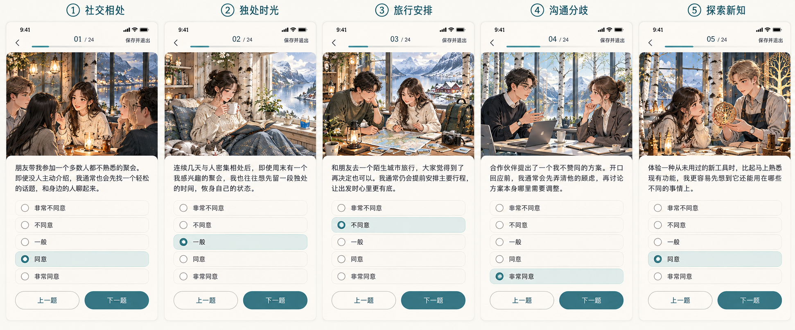

# 视觉设计确认稿

以下图片仅供确认视觉方向，尚未实现到小程序。正式代码仍在 main 分支。

## 三个主界面与答题界面

## 人格分享卡与抽签分享卡

## 第二版：北欧神话气质

峡湾、极光、世界树意象与克制金色纹饰，保留原生小程序交互布局。

本版文案以古典诗句作为视觉示例，后续精选引用会核对原文与出处。设计图中的历史条目仅为示例，并非真实用户记录。此版本尚未应用到代码。

## 五种答题情境示范

社交相处、独处时光、旅行安排、沟通分歧、探索新知。配图对应具体情境，未展示计分方向。题目与选中项为设计示例，正式题库另行审校。

